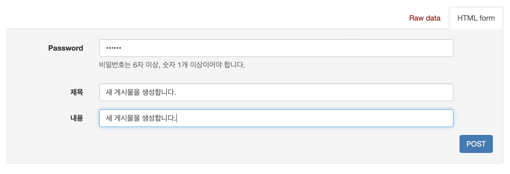
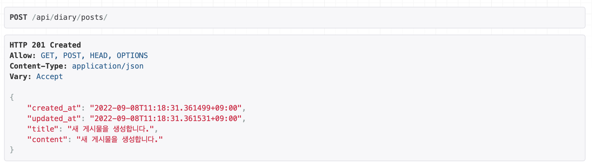
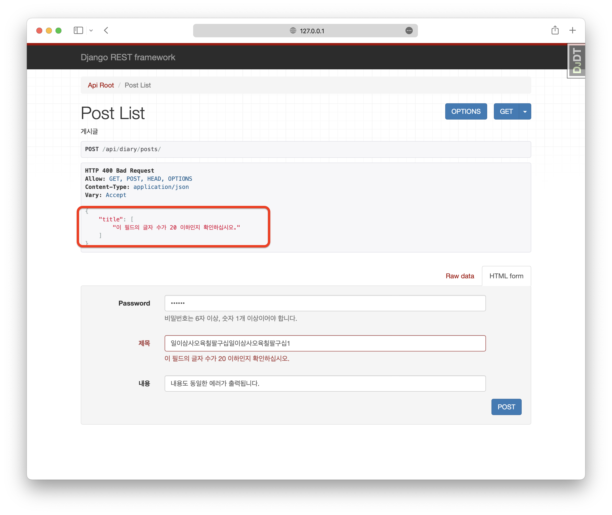
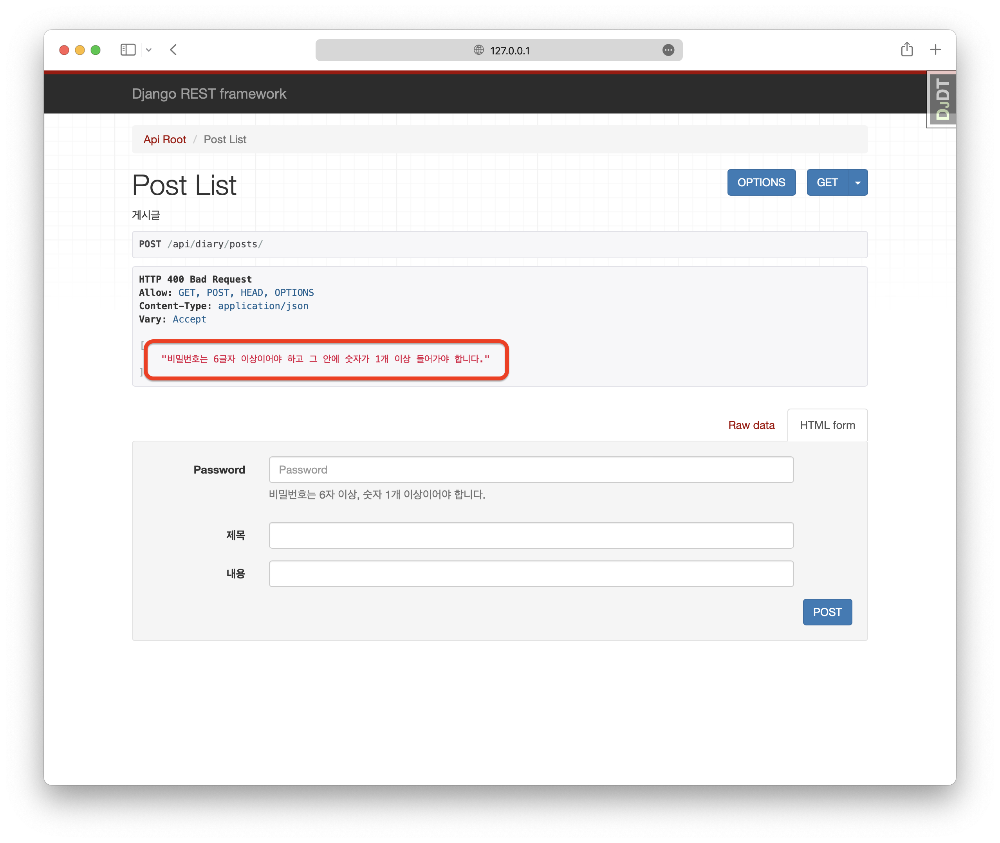
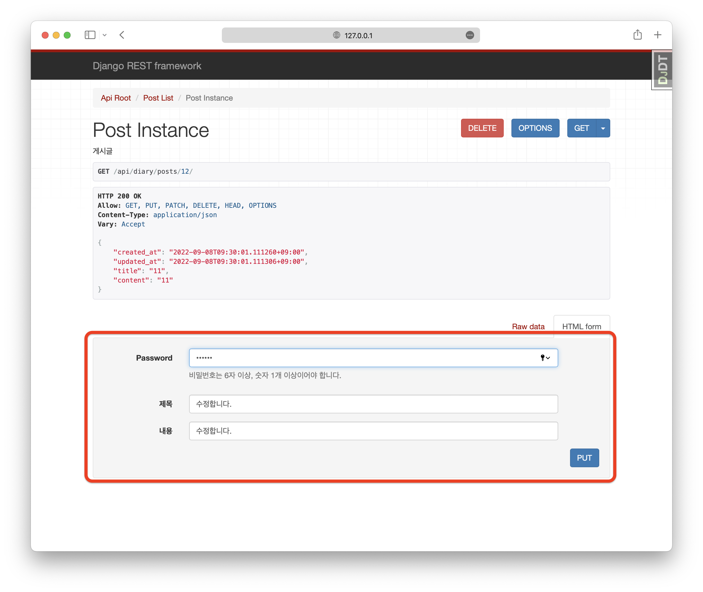
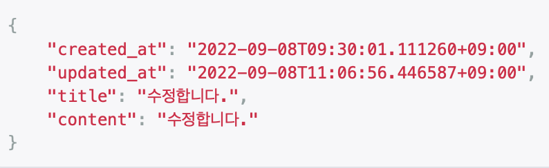

# diary_service_API
게시글 기반의 서비스입니다.

## :: 소개
게시물 비밀번호 로직이 적용된 게시판 서비스를 위한 REST API 입니다.

1. 사용자는 게시글을 올릴 수 있습니다.
    - 게시글은 제목과 본문으로 구성됩니다.
    - 제목은 최대 20자, 본문은 200자로 서버에서 제한해야 합니다.
    - 제목과 본문 모두 이모지가 포함될 수 있습니다.
    - 게시글은 최신순으로 TopDown 방식으로 나열됩니다.
2. 사용자는 게시물을 작성할 때에 비밀번호를 설정할 수 있습니다.
    - 비밀번호만 일치한다면, 수정과 삭제가 가능합니다.
    - 비밀번호는 데이터베이스에 특정 알고리즘으로 암호화되어 저장됩니다.
    - 비밀번호는 6자 이상이어야 하고, 숫자 한 개 이상이 반드시 포함되어야 합니다.
    
### ::: 기술 스택

   

### ::: 개발 기간 

- 2022.09.06 ~ 2022.09.07

## :: 프로젝트 구조

```shell
.
├── Pipfile
├── Pipfile.lock
├── README.md
├── README_assets
│   ├── List.png
│   ├── post.png
│   ├── post_complete.png
│   ├── post_max_error.png
│   ├── post_password_error.png
│   ├── put_after.png
│   ├── put_before.png
│   └── put_password_error.png
├── db.sqlite3
├── diary
│   ├── __init__.py
│   ├── admin.py
│   ├── apps.py
│   ├── migrations
│   │   ├── 0001_initial.py
│   │   └── __init__.py
│   ├── models.py
│   ├── serializers.py
│   ├── tests.py
│   ├── urls.py
│   └── views.py
├── diary_service
│   ├── __init__.py
│   ├── __pycache__
│   │   └── __init__.cpython-310.pyc
│   ├── asgi.py
│   ├── settings
│   │   ├── __init__.py
│   │   ├── __pycache__
│   │   │   ├── __init__.cpython-310.pyc
│   │   │   ├── common.cpython-310.pyc
│   │   │   └── development.cpython-310.pyc
│   │   ├── common.py
│   │   ├── development.py
│   │   └── production.py
│   ├── urls.py
│   └── wsgi.py
└── manage.py
```

## :: 어플리케이션 실행하기

```shell
# manage.py 에서 원하는 버전의 settings 설정
# 개발용: diary_sevice.settings.development
# 배포용: diary_service.settings.production
    
$ python manage.py runserver

```

# : REST API 명세
## :: Endpoint

| endpoint | HTTP Method | 기능   | require parameter                                                                                                   | response data |
|----------|-------------|------|---------------------------------------------------------------------------------------------------------------------|---------------|
| /api/diary/posts/  | GET   | 게시글 리스트 조회 |  -  | 게시글 리스트 |
| /api/diary/posts/  | POST     | 게시글 생성 | title: string <br/>content: string <br/> password: string   | 생성된 게시글 인스턴스   |
| /api/diary/posts/:id/  | PATCH     | 게시글 수정 | password: string   | 수정된 게시글 인스턴스  |
| /api/diary/posts/:id/  | DELETE   | 게시글 삭제 |  password: string  | 성공 여부 |

- 게시글 삭제: 9월 8일 최종 수정.

## :: 게시글 리스트

**Request**
`GET /api/diary/posts/`

**Response**


## :: 게시글 생성

**Request**
`POST /api/diary/posts/`



**Response**



### ::: Error
#### :::: 글자 수 제한



> 제목은 최대 20자, 본문은 200자로 서버에서 제한해야 합니다.
>    - CharField의 max_length 옵션으로 구현하였습니다.
>    - 유지보수를 위해 공통적인 요소를 모델을 나누어 모델링하였습니다.
>    - 👉🏻 [models](https://github.com/eod940/diary_service_API/blob/master/diary/models.py)

```python
class CommonPostModel(TimeStampModel):
    title = models.CharField(max_length=20, verbose_name="제목")
    content = models.CharField(max_length=200, verbose_name="내용")
    password = models.CharField(max_length=128, verbose_name="비밀번호")
```

#### :::: 비밀번호 검증



> 비밀번호는 6자 이상이어야 하고, 숫자 한 개 이상이 반드시 포함되어야 합니다.
>    - serializers 에서 validate_password 를 이용하여 검증하였습니다.
>    - 👉🏻 [serializers.validate_password](https://github.com/eod940/diary_service_API/blob/master/diary/serializers.py)

```python
# diary/serializer.py
def validate_password(password):
    """
    게시물 생성시 비밀번호 검증을 위한 함수입니다.
    - 비밀번호는 6글자 이상, 숫자 1개 이상입니다.
        - 위 조건을 만족한다면 password를 반환합니다.
        - 이외에는 ValidationError를 띄웁니다.
    """
    if len(password) >= 6 and any(char.isdigit() for char in password):
        return password
    else:
        raise ValidationError("비밀번호는 6글자 이상이어야 하고 그 안에 숫자가 1개 이상 들어가야 합니다.")

```
 
> 비밀번호는 데이터베이스에 특정 알고리즘으로 암호화되어 저장됩니다.
>   - Django에서 제공하는 make_password 함수를 사용하였습니다.
>   - [여기를](https://docs.djangoproject.com/en/4.1/topics/auth/passwords/#module-django.contrib.auth.hashers) 참조하였습니다.
>   - 비밀번호 검증 후에 암호화되어 저장됩니다.
>   - 👉🏻 [serializers.validate_password](https://github.com/eod940/diary_service_API/blob/master/diary/serializers.py)

```python
# diary/serializer.py
class PostSerializer(serializers.ModelSerializer):
    ...
    def create(self, validated_data):
        """
        게시물을 생성합니다.
        비밀번호 검증 후 암호화합니다.
        """
        validate_password(validated_data['password'])  # 비밀번호 검증(6자이상, 숫자 1개+)
        validated_data['password'] = make_password(validated_data.get('password'))  # 비밀번호 암호화
        return super(PostSerializer, self).create(validated_data)
```

## :: 게시물 수정

**Request**
`PUT /api/diary/posts/:id`

**Response**



### ::: Error
#### :::: 비밀번호가 다를 시


---

# : 테스트 코드
직접 만든 로직 검증을 진행하였습니다.  
[테스트 코드](https://github.com/eod940/diary_service_API/blob/master/diary/tests.py)

---

# : 프로젝트 개발 고민

1. app 관리를 어떻게 해야 할지 고민하였습니다.
   - 추후 User를 구현하기 위해 diary app에서는 User와 관련된 것을 적용하지 않았습니다.
   - 추후 새로운 기능 업데이트시 새로운 app을 시작하여 User와 연동을 구현하는 등 유지보수적 측면을 고려하였습니다.
   
2. 비밀번호 관리를 어떻게 해야 할지 고민하였습니다.
   - 암호화된 비밀번호를 저장하기 위해 [Django](https://docs.djangoproject.com/en/4.1/topics/auth/passwords/#module-django.contrib.auth.hashers), [Django-rest-framework](https://www.django-rest-framework.org/api-guide/validators/#updating-nested-serializers) 문서를 찾아다녔습니다.
   - 직접만든 로직과 `make_password()`를 이용해 할 수 있는 선에서 최대한 구현하였습니다.
   
최종 작성: 2022-09-08

